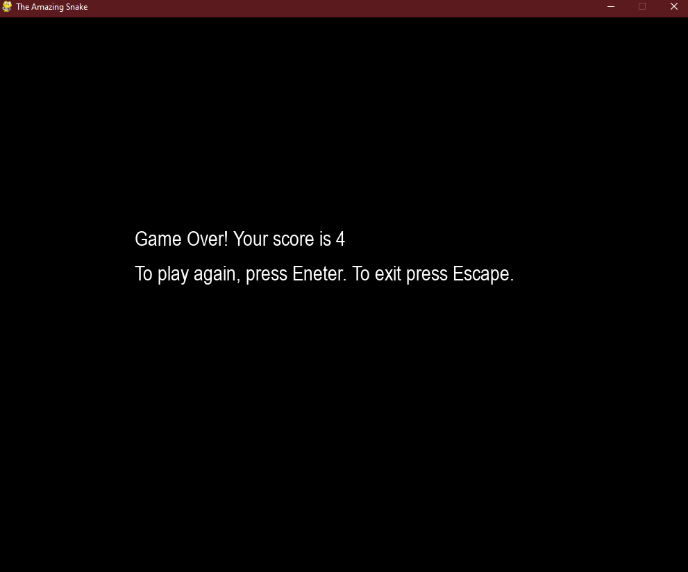

# SnakeGame
 
The player can play snake using the left, right, up, and down arrows keys:  
  
The player can score points if the snake will eat the red dot. Each red dot the player can score one point.  
If the player lost, he could continue the game by pressing enter or he can exit the game by pressing exit key:  
  
 
Simple snake game was developed on python.
